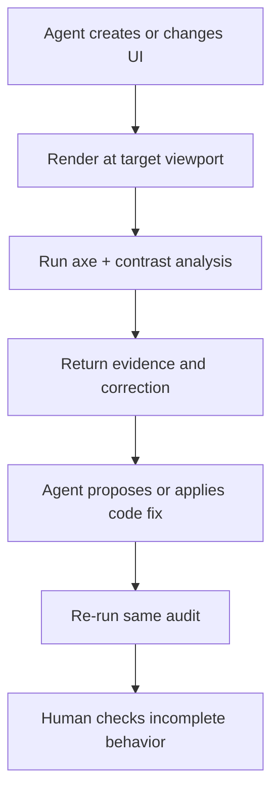

# A11y Feedback MCP

Give coding and design agents a real accessibility feedback loop instead of another reminder to “follow WCAG.”

`a11y-feedback-mcp` renders an interface in Chromium, runs [axe-core](https://github.com/dequelabs/axe-core), and returns actionable evidence to any Model Context Protocol client: violated rules, impact, CSS selectors, DOM snippets, computed styles, bounding boxes, remediation steps, and mathematically passing contrast candidates.

It works directly with **Codex** and **Claude Code**. For **Claude Design**, the reliable workflow is to connect Claude Code to both Claude Design's MCP server and this server, then audit the generated HTML or live preview and send corrections back through the design workflow.

> This is an automated testing aid, not a WCAG certification service. It deliberately reports incomplete checks and requires human testing for keyboard, focus, screen readers, zoom, motion, cognition, and content quality.

## What “live feedback” means



The server is read-only. It never silently edits a project. The connected agent uses the evidence to make a scoped change, then reruns the audit to verify it.

## Tools

| Tool | Purpose |
|---|---|
| `audit_url` | Audit a rendered public or local development URL |
| `audit_html` | Audit generated HTML before it is hosted |
| `audit_file` | Audit a local `.html`/`.htm` file inside an allowed project root |
| `check_contrast` | Calculate WCAG contrast for a color pair and text style |
| `suggest_contrast_fix` | Propose the smallest black/white-directed color adjustment that passes |
| `explain_issue` | Turn an axe rule ID into implementation and verification guidance |
| `get_wcag_checklist` | Return the complete A/AA/AAA criterion set with W3C links and automated/manual coverage |

All tools are annotated read-only. The server also exposes an `accessibility-fix-loop` prompt.

### Standards profiles

The audit tools support `wcag2a`, `wcag2aa`, `wcag2aaa`, `wcag21aa`, `wcag21aaa`, `wcag22aa`, `wcag22aaa`, and `best-practice`. AA profiles include all required A and AA criteria; AAA profiles include A, AA, and AAA. `wcag22aa` remains the default because W3C recommends the latest WCAG version and cautions against requiring whole-site AAA as a general policy. Use AAA as an explicit enhanced target and report criterion-level progress.

An axe mapping means **partial automated coverage**, never that the complete success criterion was tested. `get_wcag_checklist` exposes all 55 criteria required for WCAG 2.2 AA or all 86 required for WCAG 2.2 AAA, including the manual work automation cannot complete.

## Requirements

- Node.js 20 or newer
- Chrome or Edge recommended
- Windows, macOS, or Linux

The server looks for installed Chrome/Edge first. On supported Linux environments it can fall back to the bundled `@sparticuz/chromium`. You can set `A11Y_MCP_BROWSER_PATH` to an explicit browser executable. Chromium sandboxing stays enabled by default; set `A11Y_MCP_NO_SANDBOX=true` only for constrained containers or Lambda-style runtimes that cannot launch Chrome otherwise.

## Install on Windows

Open PowerShell in the folder where you keep projects:

```powershell
git clone https://github.com/aditya-ariosity/a11y-feedback-mcp.git
cd a11y-feedback-mcp
npm install
npm run build
```

If the repository is not on GitHub yet, download or copy this folder first, then run the final three commands inside it.

## Connect Codex

From PowerShell, use the absolute path to the built entry point:

```powershell
codex mcp add a11y-feedback -- node "C:\full\path\to\a11y-feedback-mcp\dist\index.js"
```

Or add the equivalent configuration to `~/.codex/config.toml`:

```toml
[mcp_servers.a11y_feedback]
command = "node"
args = ["C:\\full\\path\\to\\a11y-feedback-mcp\\dist\\index.js"]
startup_timeout_sec = 30
tool_timeout_sec = 90

[mcp_servers.a11y_feedback.env]
A11Y_MCP_ALLOWED_ROOT = "C:\\full\\path\\to\\your-projects"
```

Restart Codex, then ask:

> Audit this page at 1440×900 and 390×844. Fix critical and serious issues, rerun both audits, and list the remaining manual checks.

See [docs/codex.md](docs/codex.md) for verification and troubleshooting.

## Connect Claude Code

```powershell
claude mcp add --scope user a11y-feedback -- node "C:\full\path\to\a11y-feedback-mcp\dist\index.js"
```

Run `claude mcp list` to confirm the connection. See [docs/claude-code-and-design.md](docs/claude-code-and-design.md) for the Claude Design bridge workflow.

## Development

```bash
npm install
npm run check
npm test
npm run test:e2e
npm run build
```

`npm test` covers color math, network protection, remediation, and the MCP contract. `npm run test:e2e` launches Chromium and audits the intentionally inaccessible fixture.

Start the local stdio server:

```bash
npm run dev
```

Start the optional Streamable HTTP transport:

```bash
npm run build
npm run start:http
```

The endpoint is `http://127.0.0.1:3000/mcp`; health is `http://127.0.0.1:3000/health`. HTTP binds to `127.0.0.1` by default.

## Environment variables

| Variable | Default | Meaning |
|---|---|---|
| `A11Y_MCP_BROWSER_PATH` | Auto-detected | Absolute Chrome/Chromium/Edge executable path |
| `A11Y_MCP_ALLOWED_ROOT` | Server working directory | Only local HTML under this root can be audited |
| `A11Y_MCP_ALLOW_PRIVATE` | `true` on stdio, `false` on HTTP | Allow localhost/private-network URL targets |
| `A11Y_MCP_ENABLE_FILE_AUDIT` | `false` on HTTP | Permit local-file audit through HTTP after root restriction |
| `A11Y_MCP_BROWSER_CONCURRENCY` | `2` | Maximum concurrent Chromium audits |
| `A11Y_MCP_AUDIT_TIMEOUT_MS` | `25000` | Deadline for the axe audit phase |
| `A11Y_MCP_NO_SANDBOX` | `false` | Launch Chromium without its sandbox only when the runtime requires it |
| `HOST` / `A11Y_MCP_HOST` | `127.0.0.1` | HTTP bind address |
| `A11Y_MCP_ALLOWED_HOSTS` | Localhost names | Comma-separated Host headers accepted by HTTP mode |
| `A11Y_MCP_BODY_LIMIT` | `4mb` | HTTP JSON body limit; must stay above the `audit_html` schema limit |
| `PORT` | `3000` | HTTP transport port |

Do not expose the reference HTTP server directly to the public internet. Put authentication, TLS, rate limits, request-size limits, and tenant isolation in front of it. Read [docs/security.md](docs/security.md).

## Current scope

The MVP covers rendered web UIs and deterministic contrast calculations. It does not yet inspect native mobile apps, PDFs, canvases, video captions, or raw Claude Design pixels. Planned adapters can add framework-aware patches, screenshot/OCR assistance, design-token integration, CI annotations, and first-class design-canvas connectors without changing the MCP contract.

## Project documents

- [Architecture and product specification](docs/architecture.md)
- [Codex setup](docs/codex.md)
- [Claude Code and Claude Design setup](docs/claude-code-and-design.md)
- [Security model](docs/security.md)
- [W3C WAI coverage model](docs/wai-coverage.md)
- [Companion agent skill](skills/accessibility-feedback/SKILL.md)
- [Contributing](CONTRIBUTING.md)

## License

[MIT](LICENSE)
